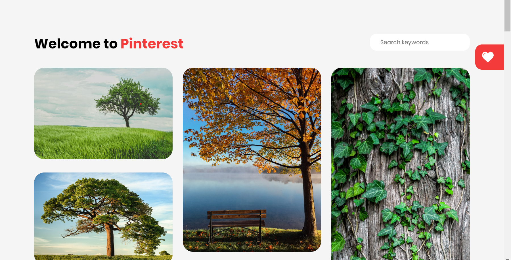

# nuxt-pinterest

> Another Fun & Awesome Project



## Demo
[Demo](https://nuxtjs-pinterest.now.sh)

## Inspiration

This project is inspired by Pinterest-liked design using [Nuxtjs](https://nuxtjs.org/) ([Vuejs](https://vuejs.org/)), which is thus far my favourite frontend framework.

I wanted to try coding the whole project using **Pure Vuejs**, and not implementing any external Vuejs plugins. And here's the results.

Other than that, I've tried to avoid using UI framework like Vuetify, or ElementUI, as part of the no external plugins challenges.

## Learning Outcome

These is what I've learnt throughout this project:
- Vuex (This is my first time exposure)
- Axios (Handle API call)
- Layout.vue (Learning to use a generic layout to style my pages)
- CSS Column & Flex (Using both to generate mansonry layout and others)
- CSS Responsive Design (I've tried to avoid responsive design until this project)
- and a bunch more minor details to great success!

##Enjoy!!

## Build Setup

```bash
# install dependencies
$ npm install

# serve with hot reload at localhost:3000
$ npm run dev

# build for production and launch server
$ npm run build
$ npm run start

# generate static project
$ npm run generate
```

For detailed explanation on how things work, check out [Nuxt.js docs](https://nuxtjs.org).
